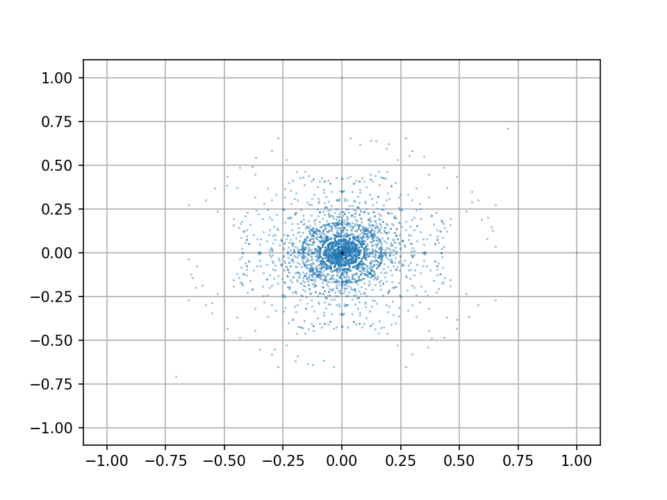

# Vector Set, Complex Structure

The idea was relatively simple: what would happen if the cross product could be defined for two dimensions? In three dimensions, the resulting vector has a magnitude equal to the area of the parallelogram spanned by the initial two vectors and it's direction is orthogonal to both of them. As we want to define something similar in two dimensions, we must forego the orthogonality. I decided to just define the resulting vector to be in the same direction as if the two initial vectors were added. The magnitude of this vector remains the same as in three dimensions: equal to the area of the parallelogram.

$$
c= e_1\%e_2 = \left(\frac{det[e_1e_2]}{||e_1+e_2||}\right)\left(e_1+e_2\right)
$$

Now that we've defined a suitable operation, we can play around with it and see what happens. Take for example two initial vectors in a set $$\{e_1,e_2\}$$ . We can apply our  two dimensional cross product to get another vector $$c=e_1\%e_2$$. Since orientation matters in calculating the area between vectors, we actually get two vectors from the initial vectors: $$c_1=e_1\%e_2, c_2=e_2\%e_1$$. Now we add these back into the set to get $$\{e_1,e_2, c_1, c_2\}$$. Now we can form new vectors again, this time using$$e_1\%c_1,e_1\%c_2,e_2\%c_1,e_2\%c_2, c_1\%c_2$$along with the respective inverses. Repeat this process a few more times and the set will quickly grow in size. We can write a python program to do just that as well as plotting the results. Below is a naive implementation utilizing my [Vector class](https://github.com/JamesRCr/VectorAlg/blob/master/Vector.py).

```python
import matplotlib.pyplot as plt
from Vector import Vector
import itertools
import logging


# Logging: Simple format for displaying info for now
logging.basicConfig(
    format="%(asctime)s [%(levelname)s] %(funcName)s: %(message)s",
    datefmt='%m/%d/%Y %I:%M:%S %p',
    level=logging.INFO
    )

logger = logging.getLogger(__name__)


def _plotter(space, dpi, name):
    """ Helper function to plot stuff """
    logger.info("Plotting image")
    plt.rcParams['axes.axisbelow'] = True
    plt.figure(dpi=dpi)
    plt.scatter([v[0] for v in space], 
                [v[1] for v in space], 
                s=(72./dpi)**2, 
                marker='.')
    plt.plot(0, 0, 'ok', markersize=1)
    plt.grid(b=True, which='major')
    plt.xlim(-1.1, 1.1)
    plt.ylim(-1.1, 1.1)
    plt.savefig(name)
    logger.info(f"Saved image at {name}")


def main(iterations, basis):
    """
    Basically iterates through each permutation of the space to create vectors 
    using the mod product
    :param iterations: Number of iterations to run 
    (BE CAREFUL!!!! STAY WITHIN 1-4)
    :param basis: Starting vector(s)
    """
    space = basis
    n = 0
    while n < iterations:
        temp = []
        for vec1, vec2 in itertools.combinations_with_replacement(space, 2):
            c1, c2 = vec1 % vec2, vec2 % vec1
            temp.extend([c1, c2])
        space.extend([v for v in temp if v not in space and len(v) == 2])
        temp.clear()
        n += 1
        logger.info(f"Iteration {n} finished: {len(space)} vectors in space")

    old_len = len(space)
    space = list(set(space))
    logger.info(f"Removed {old_len-len(space)} redundant vectors")
    logger.info(f"Current vector count: {len(space)}")
    _plotter(space, 150, 'vecspace.png')


if __name__ == '__main__':
    main(4, [Vector([1, 0]), Vector([0, 1])])


```

As you can see it's not very stable or very fast, but it gets the job done. Running this program plots a very interesting and complex pattern.



I decided to just plot the points and not the lines of the vectors as it would become too cluttered to view. As we can see, there are interesting structures being formed from just these ~3400 points. The most obvious pattern is probably that it's symmetric about $$y=-x$$ . This is because of the anti-commutative nature of the two dimensional cross product \($$a\%b=-b\%a$$\). Other prominent features include the rings, the inner disk, the four outer 'shields', the other symmetries about$$y, x, y=x$$, and the 'spikes' protruding from the rings.

Further exploration into this construction would generate fascinating structures. The main limitation so far is time complexity, so I implore the reader to devise a new algorithm of generating the vectors in a more efficient manner. Also play around with the initial vectors in the set, the results can be amazing.

